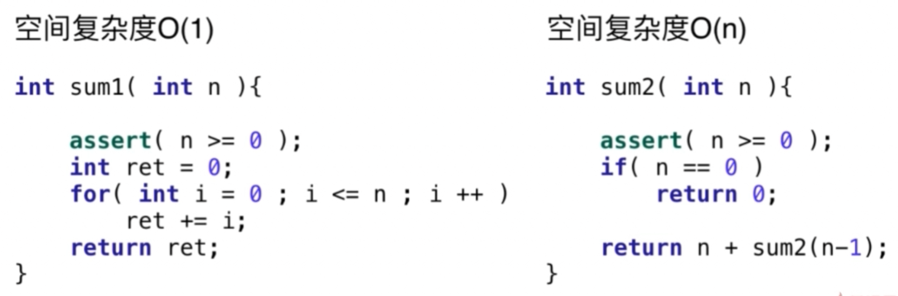
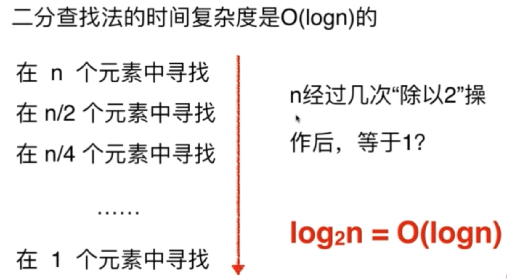
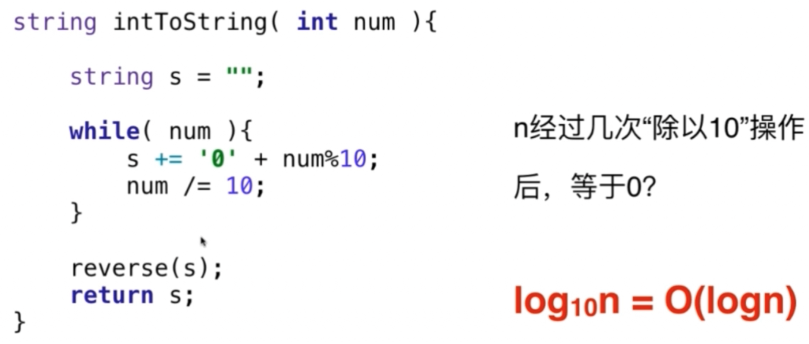
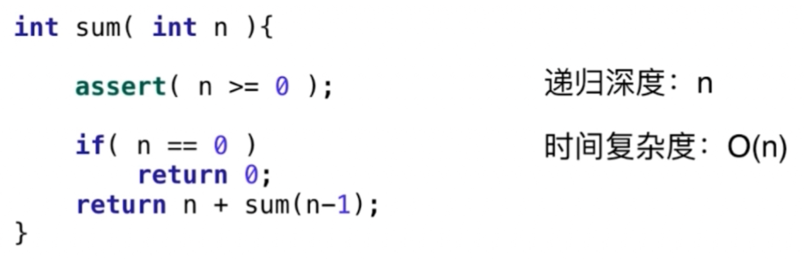
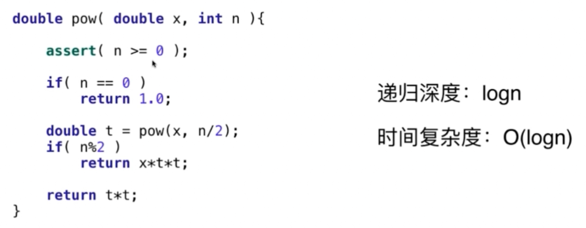
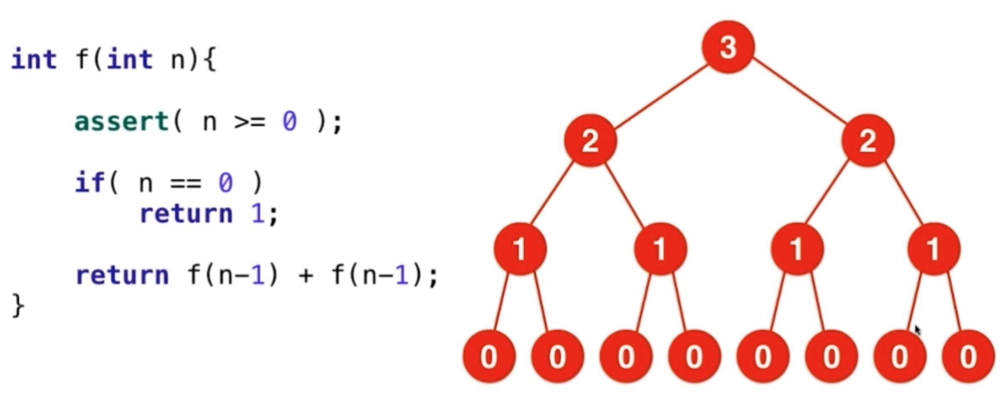
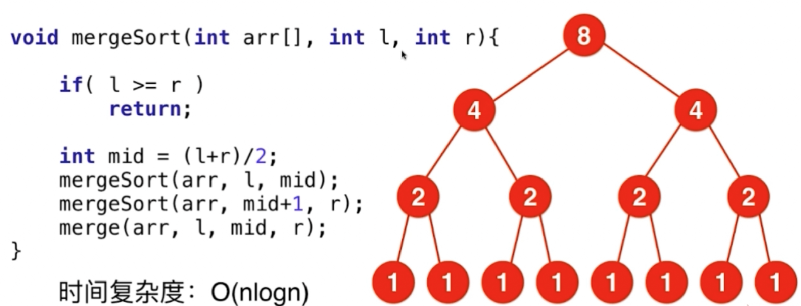
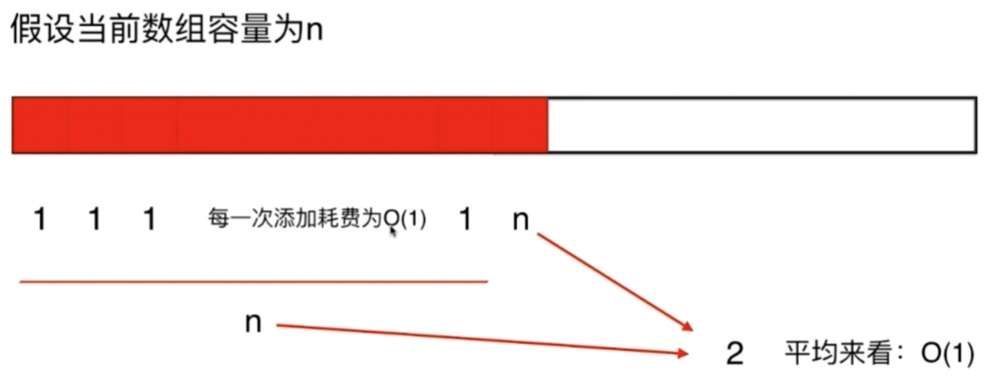

# 算法课 笔记

快排：**三路快排**，Java是这么实现的

* [算法要思考：](#算法要思考)
	* [比如问对一组数据进行排序](#比如问对一组数据进行排序)
* [什么是Big O：](#什么是big-o)
* [数据规模](#数据规模)
* [空间复杂度](#空间复杂度)
* [二分法时间复杂度理解:](#二分法时间复杂度理解)
* [递归的时间复杂度](#递归的时间复杂度)
      * [递归中进行一次递归调用](#递归中进行一次递归调用)
      * [递归中多次调用](#递归中多次调用)
* [均摊(平均、Amortized)复杂度：](#均摊平均amortized复杂度)
     * [复杂度震荡](#复杂度震荡)

## 算法要思考：

### 比如问对一组数据进行排序

要想到：

* 有没有可能包含大量重复元素？***三路快排***

* 是否大部分数据距离它正确的位置很近？是否近乎有序？***插入排序***

* 是否数据的取值范围非常有限？比如学生成绩排序 ***计数排序***

* 是否要稳定的排序？ ***归并排序***

* 是否是使用链表存储的？ ***归并排序***

* 数据的大小是否可以装在内存中？ ***外排序***

## 什么是Big O：

其实是个数学证明，但是面试时候不会这么问

O(n^2): 问题的数据规模是`n`，完成这个程序需要执行的`指令数`和`数据规模的平方`成`正比`，比如是`a * n^2`

指数：`Exponential`	平方：`Quadratic`	线性：`Linear`	Log级：`Logarithmic`	常数：`Constant`

## 数据规模

如果想要在1s之内解决问题：

`O(n^2)` 的算法可以处理大约`10^4`级别的数据

`O(n)` 的算法可以处理大约`10^8`级别的数据

`O(NlogN)` 的算法可以处理大约`10^7`级别的数据

这个大概有个感觉就好，也就是说面试官说 如果有100，或者1000个数据，也许n^2就符合要求

实际中要比上面的级别再低一个数量级，也就是分别是3，7，6

## 空间复杂度

多开一个辅助的 数组 `O(n)`，二维数组 `O(n^2)`，常数空间 `O(1)`

递归调用是有`空间代价`的，系统要存下`每个状态`，比如n个状态就是O(n)，`递归深度`就是空间复杂度

## 二分法时间复杂度理解:

类似地：

## 递归的时间复杂度

不是所有递归的函数都是`O(NlogN)`

### 递归中进行一次递归调用

比如二分中递归就是一次调用

递归深度为`depth`（实际是递归调用的次数，次数此时等于深度），每次递归中，时间复杂度为`T`

总时间复杂度就是`O(T * depth)`     比如：

每次递归只减少一个元素，所以深度是`n`，每次递归时间是`O(1)`所以总时间`O(n)`

另一种，递归深度O(logN)，每次递归O(1)，总时间O(logN)

### 递归中多次调用

关注`递归调用次数`，而不是`深度`，画`递归树`

比如：

调用次数就是`节点数`，数据规模是`n`深度是`n`，每层节点数相加结果`2^(n+1)-1`，就是`指数级别`，每个点是`O(1)`，每个点要是再多消耗一些时间就更慢了。 

`归并排序`虽然是多次调用但不是`指数级别`，比如:

数据规模是`n`，深度是`logN`，每层数据规模`整体是n`，时间是`O(n)`，`logN`个`O(n)`相加就是`NlogN`

## 均摊(平均、Amortized)复杂度：

一般是某个很耗时的操作前有个if条件

比如一个`动态数组类`，一开始数组是定长的，每次`push_back`都是`O(1)`，当元素数量等于`capacity`时要2倍扩容，`resize()`是`O(n)`的因为要复制原来的元素到新数组。但`均摊复杂度`还是`O(1)`，因为每n次操作才会有一次`O(n)`的操作，平均下来，n次操作消耗`n*O(1)+O(n)`的时间，每次消耗`O(2)`所以还是`O(1)`

### 复杂度震荡

上面例子中，当`pop`的时候，如果当前剩余空间已经变成一半了就`resize()`来减少空间浪费，但如果此时缩容到1/2 的capacity就可能在临界点发生`复杂度震荡`，就是`pop`和`push_back`来回做，则每个操作都是`O(n)`。正确做法是当元素数量达到1/4时，缩容到1/2，这样平均复杂度就还是O(1)。