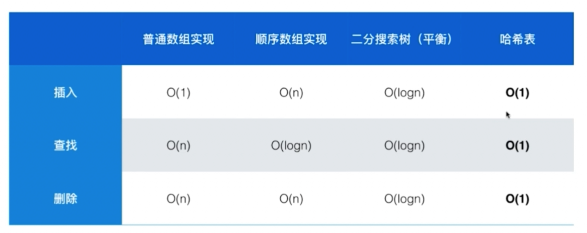

## 查找问题就是Map和Set

### 349. Intersection of Two Arrays

set典型问题

#### 1. 直接两个set取交集

#### 2. 用一个set记录数组1，再遍历数组2

#### 3. 排序两个数组，双指针

排序两个数组，然后两个指针从两个数组的起始点开始遍历，比较元素大小，后移小的那个，如果相等就看看能不能放进list里面，如果list为空或者list最后一个元素和数组元素不相等就可以放

### 350. Intersection of Two Arrays II

map典型问题

#### 1. map统计数组1中元素和对应的出现次数，遍历数组2

### 2. 同上面排序数组

follow up: 

1. 排好序就用这种解法
2. nums1很小的话就做成hashmap
3. 如果只有nums2不能放在内存中，则将nums1做成哈希表，nums2分批加载到内存中处理。

## Map的实现

***用哈希表实现会失去数据的顺序性***

#### C++中 map和set

map/set底层实现为`平衡二叉树`

unordered_map/unordered_set底层实现为`哈希表`

#### Java中 Map和Set (以及List)

***Map***

HashMap方式：哈希码算法，快速查找键值
TreeMap方式：对键按序存放

***Set***

HashSet方式：哈希码算法，加入的对象需要实现hashcode（）方法，快速查找元素
TreeSet方式：按序存放，想要有序就要实现Comparable接口

[List、Set、Map 底层实现和使用推荐](https://blog.csdn.net/zx_android/article/details/79464778)

